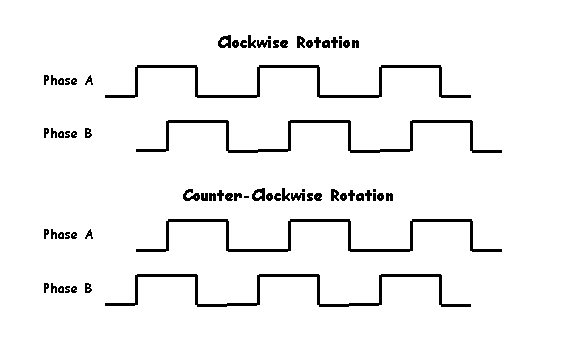
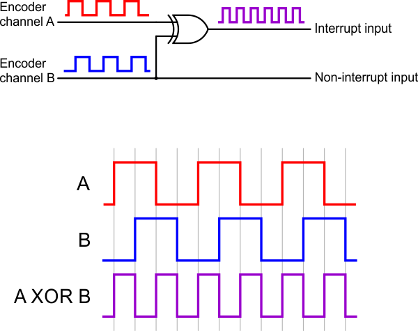

== A review of Quadrature encoder.

A quadrature encoder, also known as an incremental rotary encoder measures the speed and direction of a rotating shaft. Quadrature encoders can use different types of sensors, optical and hall effect are both commonly used. No matter what type of sensors are used the output is typically two square waveforms 90° out of phase as shown below.

If you only wish to monitor the speed of rotation then you can use either output and simply measure the frequency. The reason for having two outputs is that you can also determine the direction of shaft rotation by looking at the pattern of binary numbers generated by the two outputs. Depending on the direction of rotation you will get either

[width="100%",options="header"]
|====================
|CW  |CCW  
|00 = 0  |00 = 0  
|01 = 1  |10 = 2  
|11 = 3 |11 = 3  
|10 = 2  |01 = 1  
|====================

By feeding both outputs into an XOR gate (exclusive OR) you will get a square wave with twice the frequency regardless of direction. This can be useful as it allows one interrupt pin to monitor both encoder inputs.
  
  

  
.rightISR.cpp
[source,cpp]
----
static void rightISR()
{
    bool newRightB = FastGPIO::Pin<RIGHT_B>::isInputHigh();
    bool newRightA = FastGPIO::Pin<RIGHT_XOR>::isInputHigh() ^ newRightB;

    countRight += (newRightA ^ lastRightB) - (lastRightA ^ newRightB);

    if((lastRightA ^ newRightA) & (lastRightB ^ newRightB))
    {
        errorLeft = true;
    }

    lastRightA = newRightA;
    lastRightB = newRightB;
}
----
