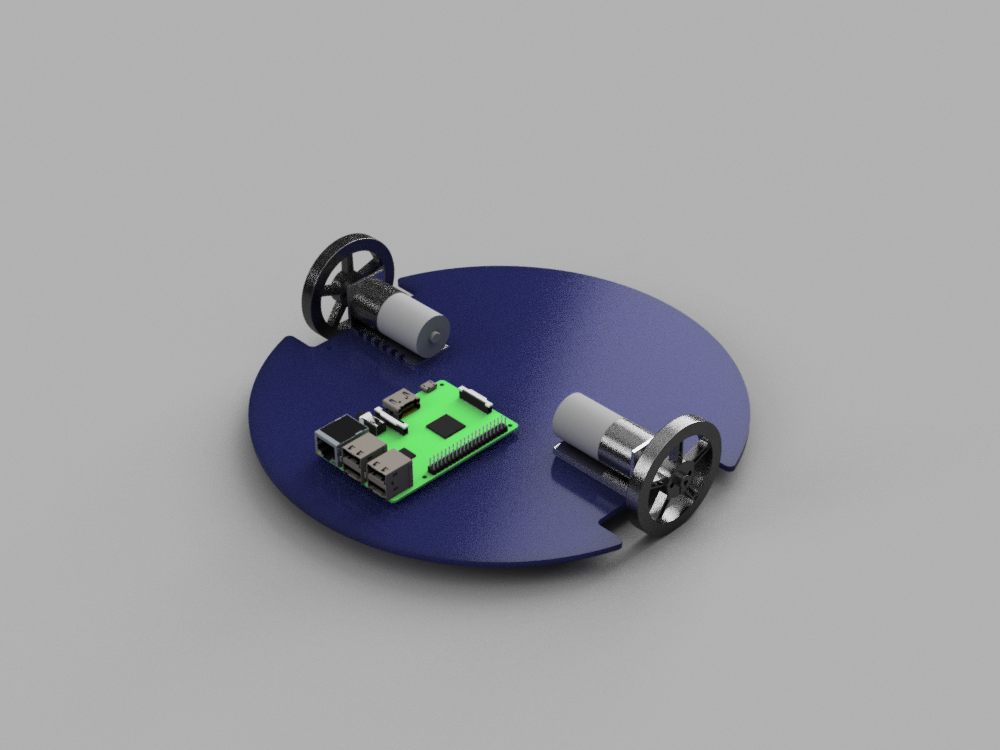

==  Purpose

Perhaps the most compelling reason for a robotics is that it introduces us to knowledge, concepts, and skills that are needed for understanding the intelligent information-based technology of the future. (Ok we love robots). We will learn skills ranging from electronics, mechanics, controls, programming, and even as broad as understanding animal behavior and human psychology.

We are looking to use ROS.

End goal to come up low-cost, personal robot kit with open-source software.

The robot is a R&D platform

.Concept Design

== Objective

*   Autonomous robot that follows a line on the ground
*   Obstacle Avoidance in the Real World
*   Dead Reckoning
*   Square Dancing/Line Dancing (Swarm behavior maybe)
*   Swarm behavior (reaching for stars here)
*   Use ROS

=== Specification

The new platform is in the design and planning stages right now. We are looking to keep cost down. But as we talk we keep adding what we like to do so the cost keep climbing. We are try to take the KISS approach: Keep It Simple, Stupid! (But not as ez as people make it sound) everyone want there feature.

=== Basic Base

So current plan build a basic base with Differential Drive. Plan is to find DC gear-motor with encoder low-cost. Low-cost mean that the encoder may or may not be great for Dead Reckoning.

==== Sensors list

Right now our sensor list is optional and we have not pick any one sensor for the jobs yet. Other than the encoder we all agree we need it if we going to be able to Square Dancing or Navigation.

==== Inertial measurement unit

Which bring in the inertial measurement unit (IMU) sensor. Inertial measurement unit works by detecting the current rate of acceleration using one or more accelerometers, and detects changes in rotational attributes like pitch, roll and yaw using one or more gyroscopes. And some also include a magnetometer, mostly to assist calibration against orientation drift.(hey guys that way north). IMU and Encoder will help us in Navigation.

==== Line Sensor

Now follows a line on the ground is simple but it is a basic behavior. Do we need it answer is no but it something work. Maze solving robot could be done if we have the sensor. Maze solving another good behavior to learn and under stand. Currently there is no plan for it. Yes we like to fly before we learn to walk.

==== Range Finders

Not need really we know where everything is in the room. Well ok we do but our robot are only know what we tell them. Oops someone move that while I was getting a snack. Obstacle avoidance is one of the most important aspects of mobile robotics. Without it robot movement would be very restrictive and fragile.

===== Optical

Sharp IR Range Finder is probably the most powerful sensor available to the everyday robot hobbyist. It is extremely effective, easy to use, very affordable ($10-$20), very small, good range. Beam Width, a major problem/advantage you may have with the Sharp IR rangefinder is beam width. Unlike sonar, its fairly thin - meaning to detect an object your sensor must basically point directly at that object. Beware of chair legs! hehe.

===== Sonar

Everyone knows how sonar works. A sound gets emitted, then you 'see' your surroundings based on the sound coming echoing back. This is because sound takes time to travel distances. Farther the distance, the longer it takes for the sound to come back. Sonar today can be bought very cheap, typically around $20-$30 each. Now suppose your robot had multiple sonar sensors on it. How would you prevent one sonar from not detecting an echo caused by another sonar sensor? What about the robot next too you also. Now this is a problem for both Sonar and Optical.

==== The Brain

We should cover this we could do the follows a line on the ground, obstacle avoidance, and dead reckoning with just a micro controllers. Remember KISS (Keep It Simple, Stupid!) here we are Stupid (not really). We are using low cost, credit-card sized computer you may have heard of it Raspberry PI. We are using Raspberry Pi 2 Model B is the second generation Raspberry Pi. It replaced the original Raspberry Pi 1 Model B+ in February 2015. Because it has an ARMv7 processor, it can run the full range of ARM GNU/Linux distributions, including Snappy Ubuntu Core, as well as Microsoft Windows 10. Ubuntu fit with our ROS wants.

==== Chassis
The Chassis laser cut or 3D printed. We are look at both option.

